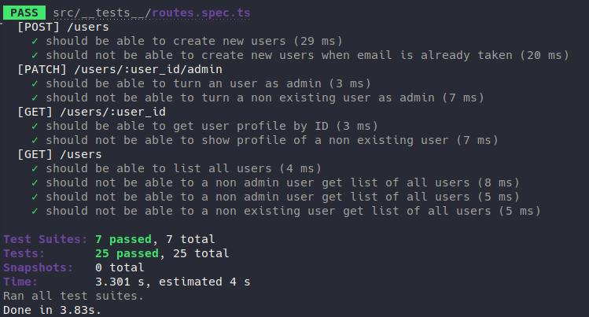
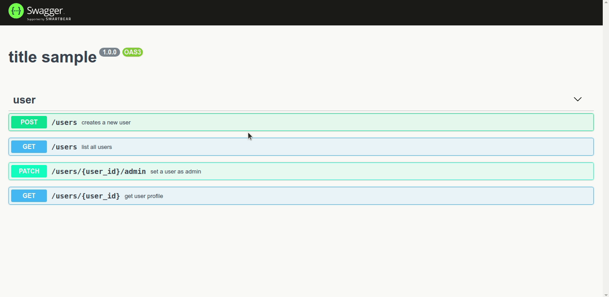

	

	<h1>SOLID and Swagger</h1>

### Summary

- [About the challenge](#about-the-challenge)

- [Tests](#Tests)

- [Docs](#Docs)

### About the challenge

- A CRUD of users. The intention is to practice SOLID principles and create API documentation using Swagger. [Click here](https://github.com/felipejsborges/ignite-2th-challenge-node-main/commit/b4c45e542c357b094aad8e048d0e923707909cc2) to see the implementation of the CRUD. And [click here](https://github.com/felipejsborges/ignite-2th-challenge-node-main/commit/db827cfdafc29bf44563ee6a4af8652ebf0f7f82) to see the implementation of the documentation

### Tests

- **`Should be able to create an user with all props`**

- **`Should be able to create new users`**

- **`Should be able to list all users`**

- **`Should be able to find user by ID`**

- **`Should be able to find user by e-mail address`**

- **`Should be able to turn an user as admin`**

- **`Should be able to create new users`**

- **`Should not be able to create new users when email is already taken`**

- **`Should be able to turn an user as admin`**

- **`Should not be able to turn a non existing user as admin`**

- **`Should be able to get user profile by ID`**

- **`Should not be able to show profile of a non existing user`**

- **`Should be able to list all users`**

- **`Should not be able to a non admin user get list of all users`**

- **`Should not be able to a non existing user get list of all users`**
 

	
	

### Docs

	
	

by Felipe Borges 
[LinkedIn](https://www.linkedin.com/in/felipejsborges) | [GitHub](https://github.com/felipejsborges)
